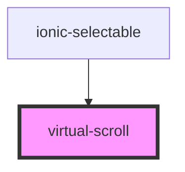

# virtual-scroll

<!-- Auto Generated Below -->

## Properties

| Property       | Attribute       | Description | Type     | Default |
| -------------- | --------------- | ----------- | -------- | ------- |
| `bottomOffset` | `bottom-offset` |             | `number` | `0`     |
| `list`         | --              |             | `any[]`  | `[]`    |
| `selector`     | `selector`      |             | `string` | `''`    |
| `virtualRatio` | `virtual-ratio` |             | `number` | `3`     |

## Events

| Event      | Description | Type                  |
| ---------- | ----------- | --------------------- |
| `toBottom` |             | `CustomEvent<number>` |
| `update`   |             | `CustomEvent<any[]>`  |

## Methods

### `clear() => Promise<void>`

#### Returns

Type: `Promise<void>`

### `forceUpdateComponent() => Promise<void>`

#### Returns

Type: `Promise<void>`

### `refresh() => Promise<void>`

#### Returns

Type: `Promise<void>`

### `scrollToNode(index: number, speed: number, offset?: number) => Promise<void>`

#### Parameters

| Name     | Type     | Description |
| -------- | -------- | ----------- |
| `index`  | `number` |             |
| `speed`  | `number` |             |
| `offset` | `number` |             |

#### Returns

Type: `Promise<void>`

### `setInfinateFinally() => Promise<void>`

#### Returns

Type: `Promise<void>`

### `setInfinateOn() => Promise<void>`

#### Returns

Type: `Promise<void>`

## Dependencies

### Used by

 - [ionic-selectable](../ionic-selectable)

### Graph

----------------------------------------------

*Built with [StencilJS](https://stenciljs.com/)*
